# CI/CD Workflow Diagram

This document contains visual diagrams of the CI/CD workflows using Mermaid syntax.

## GitHub Flow Process

```mermaid
graph TB
    Start([Developer starts work]) --> Create[Create feature branch from main]
    Create --> Code[Write code & commit]
    Code --> Push[Push to GitHub]
    Push --> PR[Open Pull Request]
    
    PR --> CI{CI Pipeline}
    CI -->|Runs| Lint[Lint Job]
    CI -->|Runs| Test[Test Job]
    
    Lint -->|Pass| LintOK[✅ Lint OK]
    Lint -->|Fail| LintFail[❌ Fix lint errors]
    LintFail --> Code
    
    Test -->|Pass| TestOK[✅ Tests OK]
    Test -->|Fail| TestFail[❌ Fix test failures]
    TestFail --> Code
    
    LintOK --> AllPass{All checks passed?}
    TestOK --> AllPass
    
    AllPass -->|Yes| Review[Code Review]
    AllPass -->|No| Code
    
    Review -->|Changes requested| Code
    Review -->|Approved| Merge[Merge to main]
    
    Merge --> Build[Build Job - Production Assets]
    Build --> Deploy[Deploy Workflow]
    Deploy --> Prod([🚀 Production])
    
    style Start fill:#e1f5e1
    style Prod fill:#e1f5e1
    style CI fill:#fff3cd
    style AllPass fill:#fff3cd
    style LintFail fill:#f8d7da
    style TestFail fill:#f8d7da
```

## CI Pipeline Details

## Deployment Workflow

```mermaid
graph TD
    subgraph "DEV Deploy Workflow (.github/workflows/deploy-dev.yml)"
        TriggerDev[Trigger: Merge to main / Manual] --> RunTestsDev[Run Tests]
        RunTestsDev --> PrepDev[Prepare Deployment]
        PrepDev --> InstallDepsDev[Install Dependencies]
        InstallDepsDev --> BuildProdDev[Build Production Assets]
        BuildProdDev --> GenEnvDev[Generate .env from Secrets]
        GenEnvDev --> PackageDev[Create ZIP Package]
        
        PackageDev --> UploadDev[Upload via SFTP to DEV]
        UploadDev --> ExtractDev[Extract on DEV Server]
        ExtractDev --> PostDeployDev[Post-Deploy Tasks]
        
        PostDeployDev --> PermissionsDev[Set Permissions]
        PermissionsDev --> CacheDev[Optimize Caches]
        CacheDev --> NotifyDev[Send Notification]
        NotifyDev --> SuccessDev([✅ DEV Deployed])
    end
    
    subgraph "PROD Deploy Workflow (.github/workflows/deploy-prod.yml)"
        TriggerProd[Trigger: Manual Only] --> RunTestsProd[Run Tests]
        RunTestsProd --> PrepProd[Prepare Deployment]
        PrepProd --> InstallDepsProd[Install Dependencies]
        InstallDepsProd --> BuildProdProd[Build Production Assets]
        BuildProdProd --> GenEnvProd[Generate .env from Secrets]
        GenEnvProd --> PackageProd[Create ZIP Package]
        
        PackageProd --> UploadProd[Upload via SFTP to PROD]
        UploadProd --> ExtractProd[Extract on PROD Server]
        ExtractProd --> PostDeployProd[Post-Deploy Tasks]
        
        PostDeployProd --> PermissionsProd[Set Permissions]
        PermissionsProd --> CacheProd[Optimize Caches]
        CacheProd --> NotifyProd[Send Notification]
        NotifyProd --> SuccessProd([✅ PROD Deployed])
    end
    
    style TriggerDev fill:#e1f5e1
    style TriggerProd fill:#ffe1e1
    style SuccessDev fill:#e1f5e1
    style SuccessProd fill:#e1f5e1
```

## Feature Branch Workflow

```mermaid
sequenceDiagram
    participant Dev as Developer
    participant Local as Local Repo
    participant Remote as GitHub
    participant CI as CI Pipeline
    participant Reviewer as Code Reviewer
    participant Main as main Branch
    
    Dev->>Local: git checkout -b feature/new-feature
    Dev->>Local: Write code & commit
    Dev->>Local: git push origin feature/new-feature
    Local->>Remote: Push feature branch
    
    Dev->>Remote: Open Pull Request
    Remote->>CI: Trigger CI pipeline
    
    CI->>CI: Run lint job
    CI->>CI: Run test job
    CI-->>Remote: Report status (✅ or ❌)
    
    Remote->>Reviewer: Request review
    Reviewer->>Remote: Review code
    
    alt Changes requested
        Reviewer->>Dev: Request changes
        Dev->>Local: Make changes
        Dev->>Remote: Push updates
        Remote->>CI: Re-run CI
    else Approved
        Reviewer->>Remote: Approve PR
    end
    
    Remote->>Main: Merge to main
    Main->>CI: Trigger build job
    CI->>CI: Build production assets
    CI->>Main: Upload artifacts
    
    Main->>CI: Trigger deploy workflow
    CI->>CI: Deploy to production
    CI-->>Dev: Notify success
```

## Rollback Process

## Branch Protection Flow

## Workflow Status Legend

| Status | Meaning |
|--------|---------|
| ✅ | Check passed |
| ❌ | Check failed |
| ⏳ | Check in progress |
| ⚠️ | Check warning |
| ⛔ | Action blocked |
| 🚀 | Deployment |
| 📦 | Build/Artifact |

## Timeline

---

**Note:** These diagrams are rendered automatically on GitHub when viewing this file. You can also use Mermaid Live Editor (https://mermaid.live) to view and edit them.
